# 拼拼樂 PinPin Go

> 一款專為香港兒童設計的普通話學習 Flutter 應用程式，透過 AI 圖像辨識、拼音測驗、聲調練習與學習紀錄，讓學習普通話變得有趣且高效。
>
> A Mandarin learning Flutter app for Hong Kong children — featuring AI photo recognition, pinyin quizzes, tone drawing, and history tracking.

---

## 截圖 Screenshots

<div align="center">

| | | |
|---|---|---|
| 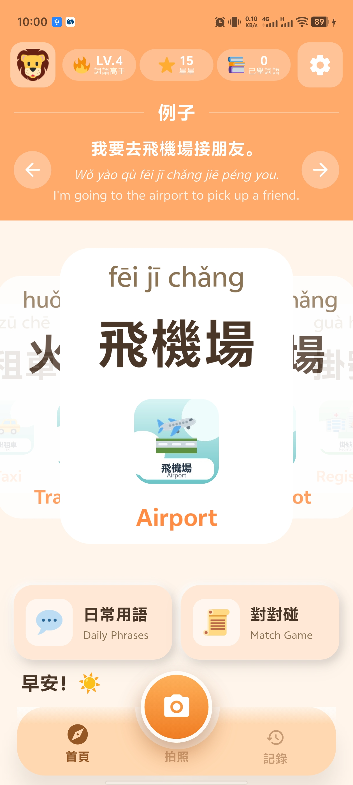 | 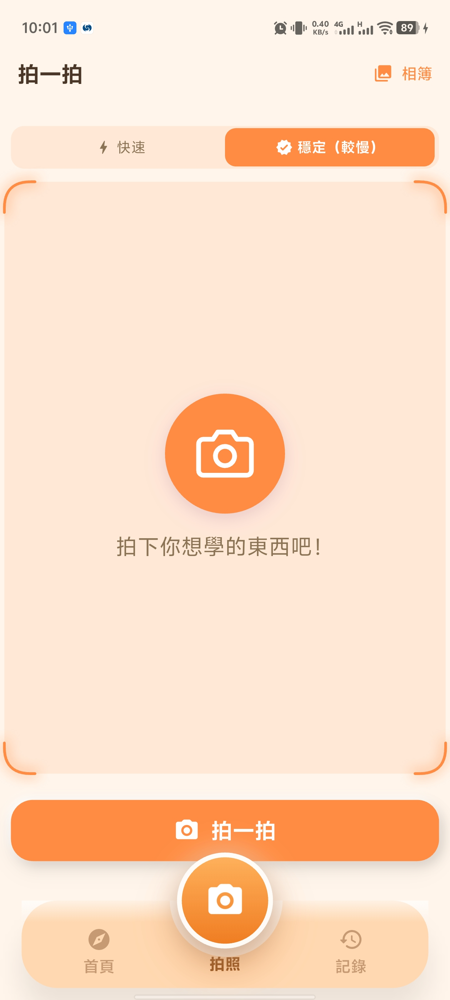 | 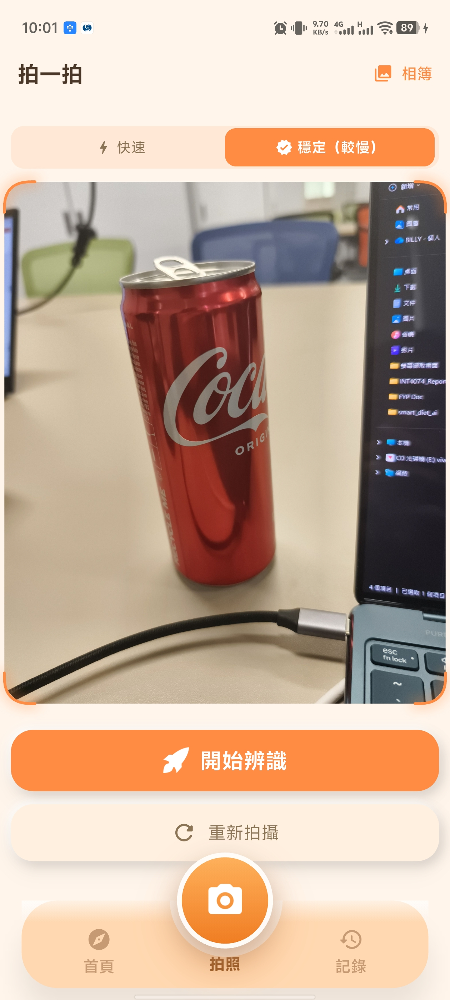 |
| 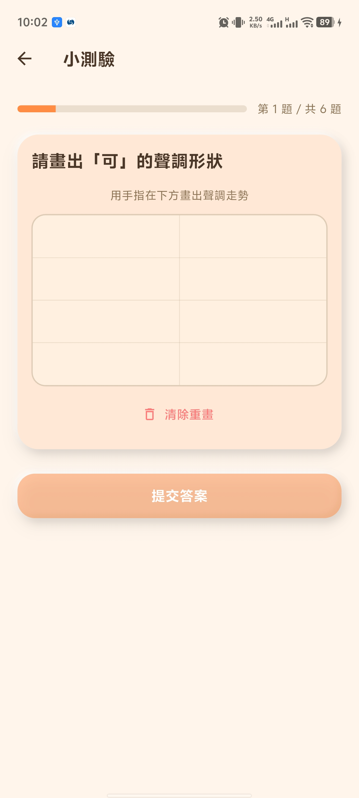 | 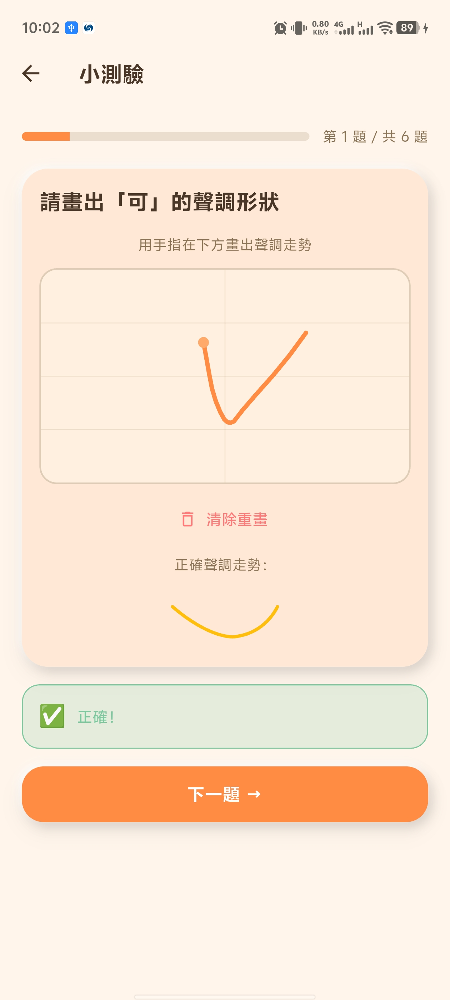 | 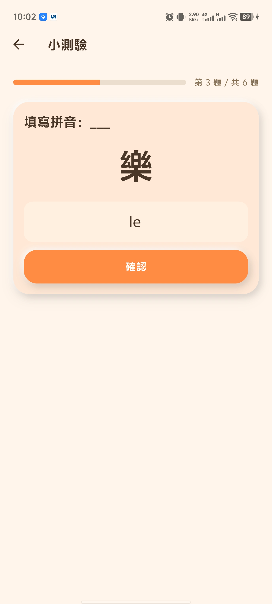 |
| 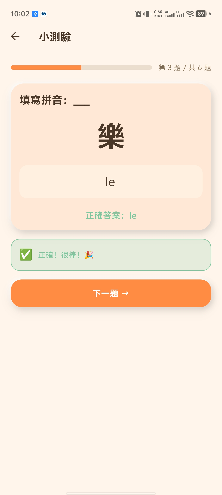 | 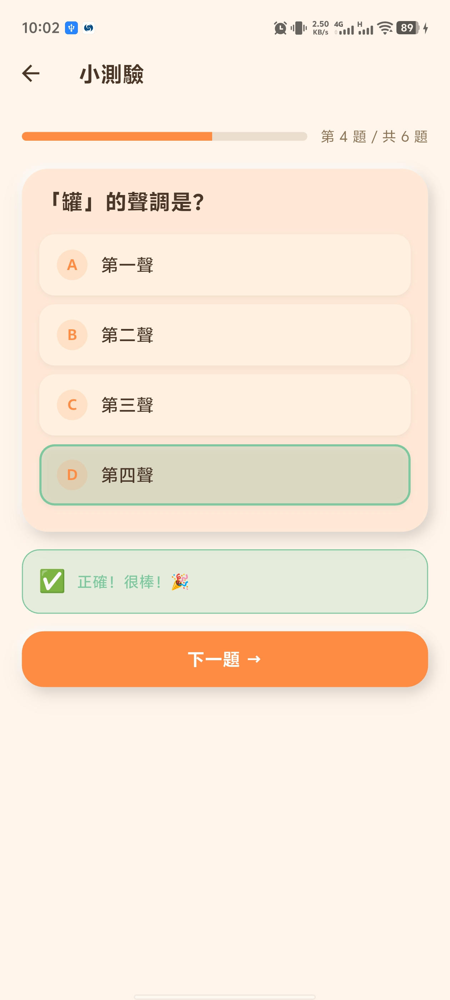 | 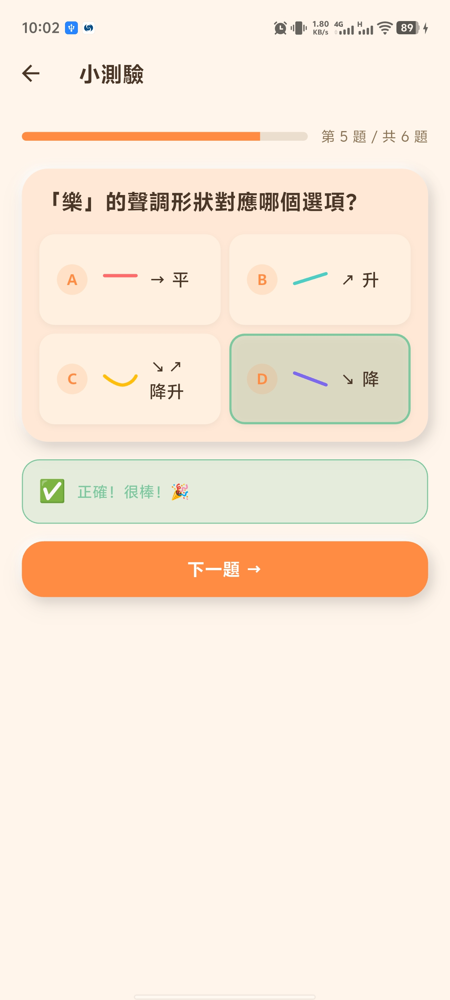 |
| 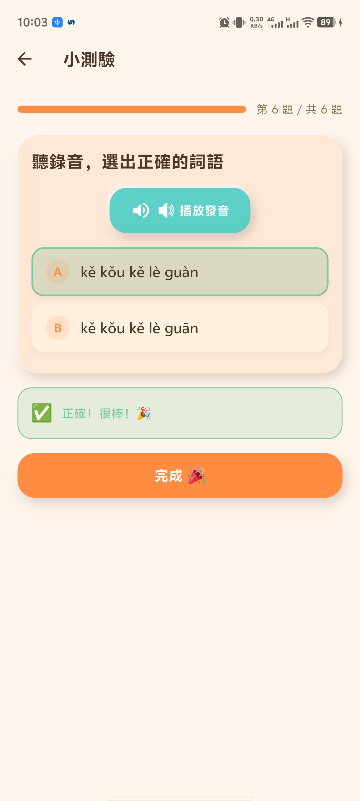 | 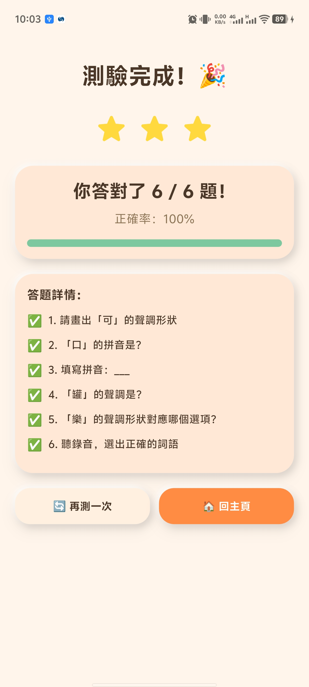 | 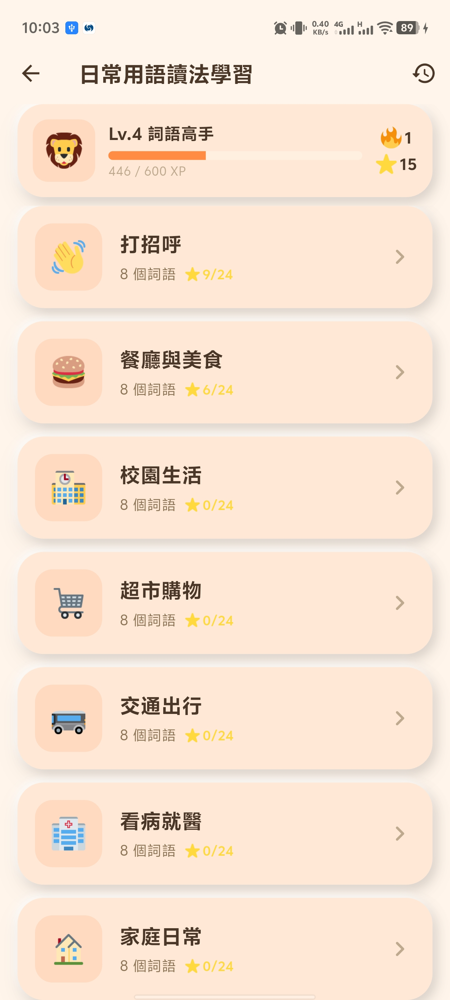 |
| 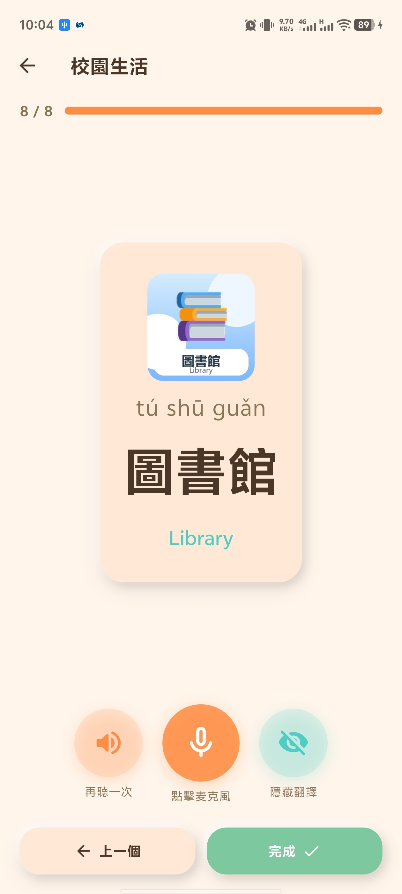 | 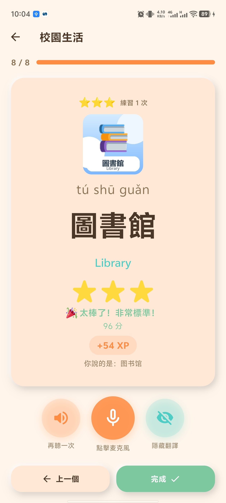 | 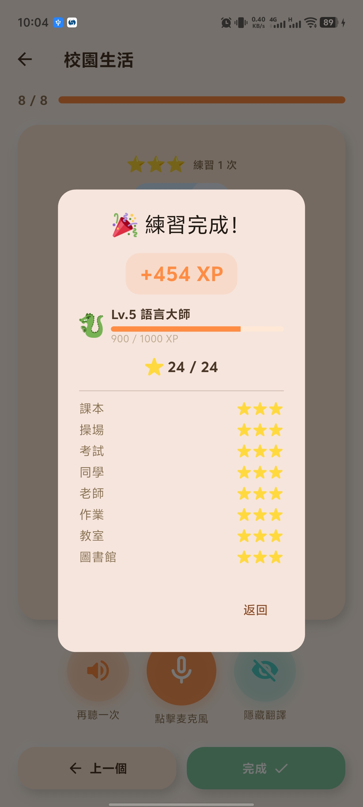 |
| 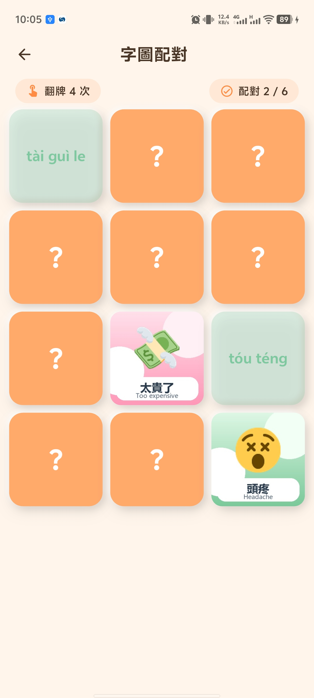 | 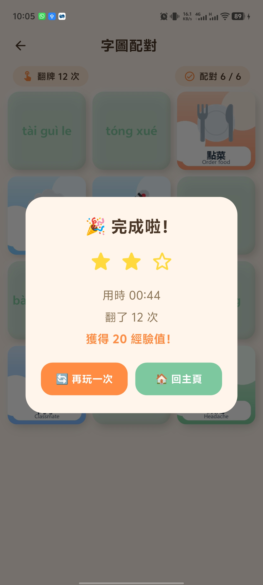 | 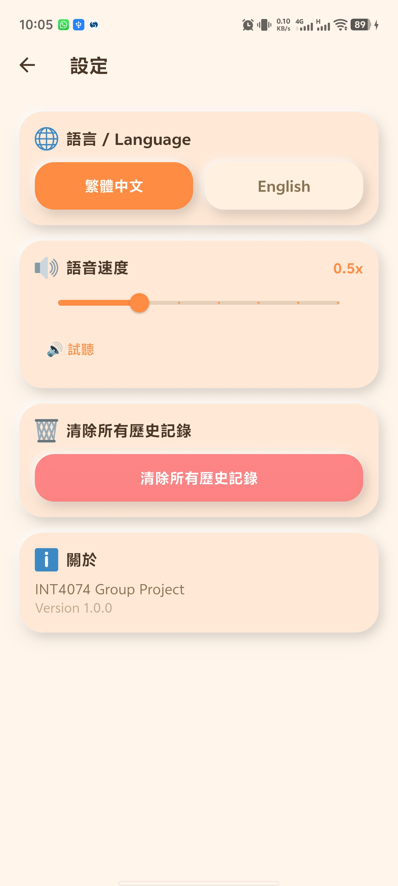 |
| 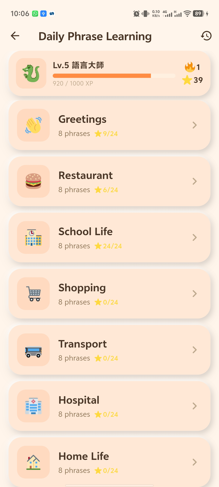 | 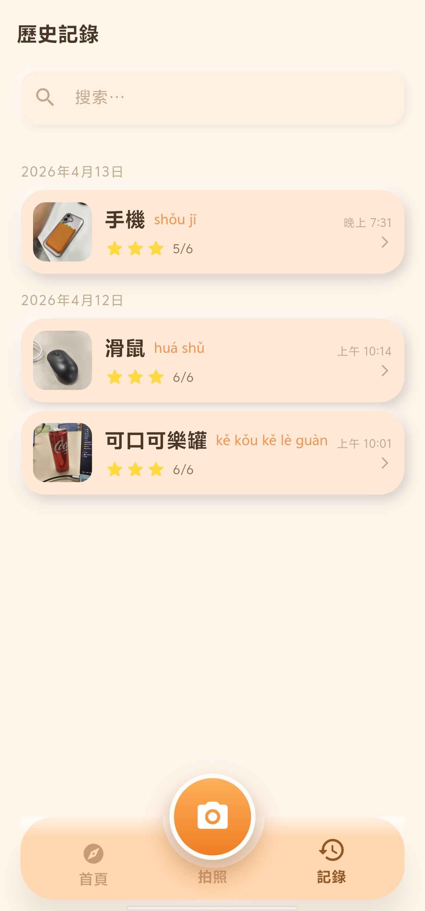 | 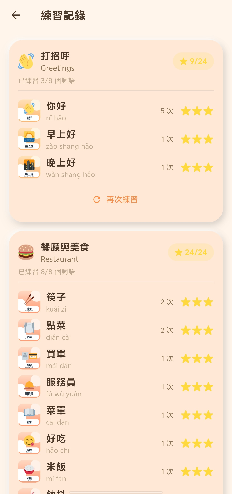 |
| 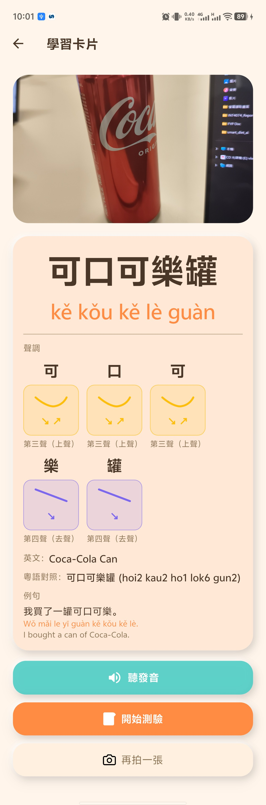 | | |

</div>

---

## 目錄 Table of Contents

1. [截圖 Screenshots](#截圖-screenshots)
2. [功能概覽 Features](#功能概覽-features)
3. [技術棧 Tech Stack](#技術棧-tech-stack)
4. [整體架構 Architecture](#整體架構-architecture)
5. [目錄結構 Directory Structure](#目錄結構-directory-structure)
6. [各層詳解 Layer Breakdown](#各層詳解-layer-breakdown)
   - [入口與初始化](#入口與初始化-entry--initialization)
   - [Config 層](#config-層)
   - [Model 層](#model-層)
   - [Service 層](#service-層)
   - [Provider 層（狀態管理）](#provider-層狀態管理)
   - [Widget 層（共用元件）](#widget-層共用元件)
   - [Screen 層（畫面）](#screen-層畫面)
   - [Utils 工具層](#utils-工具層)
   - [本地化 i18n](#本地化-i18n)
6. [資料流 Data Flow](#資料流-data-flow)
7. [畫面導航圖 Navigation Map](#畫面導航圖-navigation-map)
8. [Android 權限](#android-權限)
9. [環境設置與運行](#環境設置與運行-setup--run)

---

## 功能概覽 Features

| 功能 | 說明 |
|---|---|
| 📸 **拍照辨識** | 拍攝或從相簿選圖，AI 辨識物品並回傳繁體中文詞彙、拼音、聲調及例句 |
| 🎮 **智能測驗** | AI 根據辨識結果自動生成 5 題測驗（5 種題型：聲調描繪、選拼音、聽音選字、選聲調、聲調輪廓配對） |
| ✏️ **聲調手繪** | 在格線畫布上手繪聲調曲線，AI 即時判斷對錯並給予反饋 |
| 🎤 **文字轉語音** | 以普通話（zh-CN）朗讀詞彙，可調整語速 |
| 📚 **學習歷史** | 持久化儲存所有學習紀錄，支援搜尋、分組、滑動刪除，並顯示每次測驗星級 |
| 🌐 **雙語介面** | 支援繁體中文與英文介面切換 |
| ⭐ **星級評分** | 測驗結果以 1–3 顆星評分（≥80% 得 3 星，≥60% 得 2 星） |
| 🎨 **黏土風格 UI** | 全應用採用 Claymorphism（擬黏土）設計，配以溫暖色調與陰影 |

---

## 技術棧 Tech Stack

| 類別 | 套件 / 技術 |
|---|---|
| UI 框架 | Flutter 3.x (Material 3) |
| 狀態管理 | `provider ^6.1.0` (`ChangeNotifier`) |
| 本地儲存 | `hive ^2.2.3` + `hive_flutter` + `hive_generator`（代碼生成） |
| AI API | `http ^1.2.0` → `api.apiplus.org` (OpenAI-compatible, 模型：`gemini-3.1-flash-lite-preview`) |
| 圖像選取 | `image_picker ^1.0.7` |
| 文字轉語音 | `flutter_tts ^3.8.5` |
| 本地化 | `flutter_localizations` + `intl ^0.20.2` + ARB 文件 |
| 路徑處理 | `path_provider ^2.1.2` |
| 唯一 ID | `uuid ^4.3.3` |
| 代碼生成 | `build_runner ^2.4.8` |

---

## 整體架構 Architecture

本應用採用 **分層架構（Layered Architecture）**，各層職責清晰分離：

```
┌──────────────────────────────────────────────────┐
│                   UI 層 (Screens)                 │
│  SplashScreen  HomeScreen  CameraScreen  ...      │
├──────────────────────────────────────────────────┤
│              共用元件層 (Widgets)                  │
│  ClayButton  ToneDrawingCanvas  StarRating  ...   │
├──────────────────────────────────────────────────┤
│            狀態管理層 (Providers)                  │
│  LocaleProvider  HistoryProvider  QuizProvider    │
├──────────────────────────────────────────────────┤
│               服務層 (Services)                   │
│  ApiService  StorageService  TtsService  ...      │
├──────────────────────────────────────────────────┤
│               資料模型層 (Models)                  │
│  RecognitionResult  QuizQuestion  LearningRecord  │
├──────────────────────────────────────────────────┤
│         基礎設施層 (Config / Utils / i18n)         │
│  ApiConfig  AppColors  Routes  Constants  ARB     │
└──────────────────────────────────────────────────┘
```

**核心資料流：**
```
相機/相簿 → ImageService → ApiService (AI) → RecognitionResult
    → StorageService (Hive) → HistoryProvider → HomeScreen / HistoryScreen

RecognitionResult → ApiService (AI) → QuizQuestion[]
    → QuizProvider → QuizScreen → QuizAttempt → StorageService
```

---

## 目錄結構 Directory Structure

```
flutter_app/
├── android/
│   └── app/src/main/AndroidManifest.xml  # 相機/儲存權限
├── ios/                                   # iOS 標準腳手架
├── lib/
│   ├── main.dart                          # 應用入口，含延遲初始化保護
│   ├── app.dart                           # MultiProvider + MaterialApp + i18n
│   ├── config/
│   │   ├── api_config.dart                # API endpoint、key、model
│   │   ├── routes.dart                    # 命名路由 + 頁面轉場動畫
│   │   └── theme.dart                     # AppColors、clayDecoration、buildAppTheme
│   ├── l10n/
│   │   ├── app_zh.arb                     # 中文字串（~80 個 key）
│   │   ├── app_en.arb                     # 英文字串（~80 個 key）
│   │   ├── app_localizations.dart         # 生成的本地化委託
│   │   ├── app_localizations_zh.dart      # 生成的中文實現
│   │   └── app_localizations_en.dart      # 生成的英文實現
│   ├── models/
│   │   ├── recognition_result.dart        # AI 辨識結果模型
│   │   ├── quiz_question.dart             # 測驗題目模型
│   │   ├── learning_record.dart           # Hive 持久化模型（4 個 class）
│   │   └── learning_record.g.dart         # 生成的 Hive 適配器
│   ├── services/
│   │   ├── api_service.dart               # AI API 調用（辨識/測驗/聲調判斷）
│   │   ├── image_service.dart             # 相機/相簿選圖 + 本地儲存
│   │   ├── storage_service.dart           # Hive CRUD + 設定讀寫
│   │   └── tts_service.dart               # flutter_tts 封裝
│   ├── providers/
│   │   ├── locale_provider.dart           # 語言狀態（zh/en）
│   │   ├── history_provider.dart          # 學習紀錄狀態 + 統計
│   │   └── quiz_provider.dart             # 測驗進行狀態
│   ├── widgets/
│   │   ├── clay_button.dart               # 可按壓擬黏土按鈕
│   │   ├── clay_card.dart                 # 靜態擬黏土卡片
│   │   ├── clay_container.dart            # 有尺寸的擬黏土容器
│   │   ├── clay_text_field.dart           # 擬黏土風格輸入框
│   │   ├── feature_card.dart              # 首頁功能格子卡片
│   │   ├── loading_animation.dart         # 3 點彈跳載入動畫
│   │   ├── star_rating.dart               # 動畫星級評分（1–3 星）
│   │   ├── tone_display.dart              # 聲調輪廓晶片（含標籤）
│   │   ├── tone_drawing_canvas.dart       # 手繪聲調畫布（格線 + 觸控）
│   │   └── tone_painter.dart              # 聲調輪廓繪製器
│   ├── screens/
│   │   ├── splash_screen.dart             # 開場動畫（1.8 秒自動跳轉）
│   │   ├── home_screen.dart               # 首頁（統計 + 功能格 + 近期詞彙）
│   │   ├── camera_screen.dart             # 選圖 → AI 辨識 → 儲存紀錄
│   │   ├── result_screen.dart             # 學習卡（詞彙 + TTS + 開始測驗）
│   │   ├── quiz_screen.dart               # 5 種題型測驗畫面
│   │   ├── quiz_result_screen.dart        # 測驗結果（星級 + 題目詳解）
│   │   ├── history_screen.dart            # 學習歷史列表（搜尋 + 滑動刪除）
│   │   ├── history_detail_screen.dart     # 歷史詳情 + 測驗紀錄
│   │   └── settings_screen.dart           # 設定（語言 / TTS 速度 / 清除）
│   └── utils/
│       ├── constants.dart                 # 佈局常數 + 聲調顏色/形狀輔助
│       ├── date_formatter.dart            # 雙語日期時間格式化
│       └── stroke_analyzer.dart           # 筆劃描述 + 本地啟發式聲調辨識
├── l10n.yaml                              # 本地化生成設定
├── pubspec.yaml                           # 依賴聲明
└── test/
    └── widget_test.dart
```

---

## 各層詳解 Layer Breakdown

### 入口與初始化 (Entry & Initialization)

**`lib/main.dart`**

使用 `AppLoader`（`StatelessWidget` + `FutureBuilder`）延遲初始化 Hive，防止 ANR（應用無響應）：

```
main() → runApp(AppLoader)
  └─ FutureBuilder(StorageService.init())
       ├─ 初始化中 → 顯示 CircularProgressIndicator
       └─ 完成（含錯誤） → 啟動 PinPinGoApp
```

**`lib/app.dart`**

- `MultiProvider` 注入 3 個 Provider
- `Consumer<LocaleProvider>` 監聽語言切換並重建 `MaterialApp`
- 配置 `AppLocalizations.delegate` 等 4 個本地化委託
- 初始路由：`/`（SplashScreen）

---

### Config 層

| 文件 | 職責 |
|---|---|
| `api_config.dart` | 定義 `baseUrl`、`apiKey`、`model`（集中管理，方便替換） |
| `theme.dart` | `AppColors`（15 個常數色）、`clayDecoration()`（擬黏土 BoxDecoration）、`buildAppTheme()`（Material 3 主題） |
| `routes.dart` | 9 條命名路由的生成邏輯；`/result`、`/quiz` 等使用向右滑入轉場，`/splash` 使用淡入轉場 |

**路由表：**

| 路由 | 畫面 |
|---|---|
| `/` | SplashScreen |
| `/home` | HomeScreen |
| `/camera` | CameraScreen |
| `/result` | ResultScreen |
| `/quiz` | QuizScreen |
| `/quiz-result` | QuizResultScreen |
| `/history` | HistoryScreen |
| `/history-detail` | HistoryDetailScreen |
| `/settings` | SettingsScreen |

---

### Model 層

#### `RecognitionResult` & `CharacterTone`

AI 圖像辨識的返回結構：
- 詞彙的中英文名稱、拼音（含/不含聲調符號）
- 每個字的 `CharacterTone`（字符、拼音音節、聲調數字 1–4/0、中英文聲調名稱）
- 粵語參考讀音、例句（中文/拼音/英文）
- 靜態方法 `tryParseFromRawJson(String)` 自動去除 AI 回傳的 Markdown 代碼圍欄

#### `QuizQuestion`

測驗題目結構，包含題目類型（`draw_tone` / `pick_pinyin` / `listen_pick_char` / `pick_tone` / `match_tone_shape`）、選項、正確答案索引、TTS 文本等。

#### Hive 持久化模型（`learning_record.dart`）

| Class | Hive typeId | 說明 |
|---|---|---|
| `LearningRecord` | 0 | 主學習紀錄（含辨識結果欄位 + `quizAttempts` 列表） |
| `CharacterToneHive` | 1 | Hive 可序列化的聲調資料 |
| `QuizQuestionResult` | 2 | 單題作答結果 |
| `QuizAttempt` | 3 | 一次完整測驗嘗試（分數、星級、題目詳情） |

`learning_record.g.dart` 由 `build_runner` + `hive_generator` 自動生成，包含所有類型適配器。

---

### Service 層

#### `ApiService`（核心 AI 服務）

所有 AI 功能通過 `http.post` 向 `api.apiplus.org` 發送 OpenAI-compatible 請求：

| 方法 | 輸入 | 輸出 | 功能 |
|---|---|---|---|
| `recognizeObject(File)` | 圖片（Base64） | `RecognitionResult` | 辨識物品，返回詞彙 + 聲調 + 例句 |
| `generateQuiz(RecognitionResult)` | 詞彙資料 | `List<QuizQuestion>` | 生成 5 題測驗 |
| `judgeToneDrawing({targetTone, strokePoints, canvasSize})` | 筆劃座標 | `ToneJudgmentResult` | AI 判斷手繪聲調是否正確 |

#### `StorageService`（Hive 封裝）

- 管理兩個 Hive Box：`learning_records`（`Box<LearningRecord>`）和 `settings`（設定數值）
- 提供完整 CRUD：`saveRecord`、`getAllRecords`（按時間降序）、`getRecord`、`deleteRecord`、`updateRecord`、`clearAllRecords`
- 設定讀寫：`getLocale/setLocale`、`getTtsSpeed/setTtsSpeed`

#### `TtsService`（TTS 封裝）

- 語言：`zh-CN`，音調：1.1
- 方法：`init`、`speak(text)`、`stop`、`setSpeed(double)`、`dispose`

#### `ImageService`（圖像服務）

- `pickFromCamera()` / `pickFromGallery()`（80% 畫質壓縮）
- `saveImageLocally(File)`：複製至 `documents/images/img_<timestamp>.jpg`

---

### Provider 層（狀態管理）

所有 Provider 均繼承 `ChangeNotifier`，通過 `Provider.of` 或 `Consumer` 在 Widget 樹中消費。

| Provider | 狀態 | 關鍵計算屬性 |
|---|---|---|
| `LocaleProvider` | 當前 `Locale`（zh/en） | — |
| `HistoryProvider` | `List<LearningRecord>` | `totalWords`、`currentStreak`（連續學習天數） |
| `QuizProvider` | 題目列表、當前題目索引、作答結果 | `correctCount`、`starRating`（1–3 星） |

**星級計算邏輯（QuizProvider）：**
- ≥ 80% 正確率 → ⭐⭐⭐
- ≥ 60% 正確率 → ⭐⭐
- 其他 → ⭐

---

### Widget 層（共用元件）

#### Claymorphism 元件組

| Widget | 說明 |
|---|---|
| `ClayButton` | 按壓時縮放至 0.95，釋放彈回，含觸覺反饋與停用態（50% 透明度） |
| `ClayCard` | 靜態擬黏土容器，可選 `onTap` 回調 |
| `ClayContainer` | 有明確 `width`/`height` 的擬黏土容器 |
| `ClayTextField` | 擬黏土風格輸入框，支援前綴/後綴圖標 |

#### 功能性元件

| Widget | 說明 |
|---|---|
| `FeatureCard` | 首頁 2×2 功能格，顯示 emoji + 雙語標題，`comingSoon` 狀態變灰 |
| `LoadingAnimation` | 3 個彩色圓點交錯彈跳，可顯示提示文字 |
| `StarRating` | 3 顆星依次以 `elasticOut` 彈入，每顆延遲 200 ms |
| `ToneDisplay` | 顯示單一聲調的輪廓晶片（輪廓圖案 + 箭頭符號 + 標籤） |
| `ToneDrawingCanvas` | 基於 `Listener` 的手繪畫布，含 4 條格線背景，觸控事件以 10 ms 節流，外部通過 `GlobalKey` 呼叫 `clear()` |
| `ToneContourWidget` | 封裝 `TonePainter`，支援動畫進度（可選 `AnimationController`） |

**`TonePainter` 各聲調繪製邏輯：**
- 第一聲：水平高線
- 第二聲：從中升至高的直線
- 第三聲：V 形曲線（三次貝塞爾曲線）
- 第四聲：從高降至低的直線
- 輕聲（0）：中央小圓點

---

### Screen 層（畫面）

#### SplashScreen
Logo 以 `elasticOut` 彈性縮放 + 淡入呈現，1.8 秒後自動導航至 `/home`。

#### HomeScreen
- 6 組錯開的滑入動畫
- 頂部：根據時間顯示問候語（早安/午安/晚安）+ 設定圖標
- 統計卡：已學詞彙數 + 連續學習天數
- 2×2 主功能格：📸 拍拍辨識、🎮 智能測驗、📚 學習歷史、❤️ 我的收藏（即將推出）
- 橫向滾動的近期詞彙列表（最多 10 個，可點擊進入詳情）
- 2×2 即將推出格：🎯 趣味遊戲、🏆 成就系統

#### CameraScreen
1. 顯示圖片預覽（未選圖時顯示佔位符動畫）
2. 底部兩個按鈕：拍照 / 從相簿選取
3. 點擊「辨識」→ `ApiService.recognizeObject` → 建立 `LearningRecord` → `HistoryProvider.addRecord` → 導航至 `/result`
4. 錯誤時顯示完整 API 錯誤訊息

#### ResultScreen
展示學習卡內容：
- 圖片縮圖
- 漢字（48px 加粗）+ 拼音
- 逐字聲調顯示（`ToneDisplay` 晶片）
- 英文翻譯、粵語參考、例句（中文/拼音/英文）
- TTS 播放按鈕
- 「開始測驗」→ `ApiService.generateQuiz` → 導航至 `/quiz`

#### QuizScreen
進度條 + 題號指示。根據 `QuizQuestion.type` 渲染對應 UI：

| 題型 | UI |
|---|---|
| `draw_tone` | `ToneDrawingCanvas` + 提交按鈕 → AI 判斷 |
| `listen_pick_char` | TTS 播放按鈕 + 4 個文字選項 |
| `match_tone_shape` | 2×2 `ToneContourWidget` 輪廓格子 |
| `pick_pinyin` / `pick_tone` | 4 個文字選項按鈕 |

答錯時觸發搖晃動畫 + `HapticFeedback`。答題後顏色反饋（綠色正確 / 紅色錯誤）。全部完成後儲存 `QuizAttempt` 並導航至 `/quiz-result`。

#### QuizResultScreen
- 動畫星級評分
- 分數卡含 `LinearProgressIndicator`
- 逐題結果清單（✅/❌ + 使用者答案 vs 正確答案）
- 兩個按鈕：重新拍照 / 返回首頁

#### HistoryScreen
- `ClayTextField` 搜尋欄（即時篩選 中文/英文/拼音）
- 按日期分組，每組顯示日期標頭
- 每條記錄：`Dismissible` 滑動刪除（確認 Dialog）+ 最後測驗星級

#### HistoryDetailScreen
與 `ResultScreen` 相同的學習卡佈局，額外顯示：
- 測驗歷史列表（最近 5 次，每次顯示星級 + 分數 + 日期）
- App Bar 刪除按鈕（含確認 Dialog）
- 「重新測驗」按鈕（重新呼叫 API 生成新題目）

#### SettingsScreen
- 語言切換按鈕（繁中 / English）
- TTS 速度滑桿（0.3–1.0，7 個分段，含試聽按鈕）
- 清除所有學習紀錄（確認 Dialog）
- 關於區塊（INT4074 Group Project、版本 1.0.0）

---

### Utils 工具層

| 文件 | 職責 |
|---|---|
| `constants.dart` | 通用圓角半徑（24/20/16）、邊距（20/16）、圖標大小（28）、動畫時長。`toneColor(int)` 和 `toneShape(int)` 輔助函數 |
| `date_formatter.dart` | `formatDate`（中文：年月日 / 英文：MMM d, yyyy）、`formatTime`（中文：上/下午 / 英文：h:mm a）、`groupKey`（YYYY-MM-DD，用作歷史列表的分組鍵） |
| `stroke_analyzer.dart` | `describe(points, size)`：將筆劃座標轉換為 AI 可理解的文字描述。`detectToneLocally(points)`：本地啟發式聲調辨識（V 形→3 聲、水平高→1 聲、上升→2 聲、下降→4 聲） |

---

### 本地化 i18n

本應用採用 Flutter 官方 `intl` 方案：

- **ARB 文件**：`lib/l10n/app_zh.arb`（預設）和 `lib/l10n/app_en.arb`，各約 80 個字串鍵
- **自動生成**：`l10n.yaml` 設定，執行 `flutter gen-l10n` 或 `flutter pub get` 時自動生成 `app_localizations.dart` 等文件
- **語言切換**：`LocaleProvider.toggleLocale()` → 持久化至 Hive → `MaterialApp` 重建

支援的本地化字串類型：
- 靜態字串（標題、標籤、按鈕文字）
- 帶參數字串（如 `statsWordsLearned(count)`、`quizResultAccuracy(percent)`）

---

## 資料流 Data Flow

### 主流程：拍照 → 學習 → 測驗

```
用戶操作                      服務/狀態                         儲存
─────────────────────────────────────────────────────────────────────
1. 拍照 / 選圖
        │
        ▼
   ImageService.pickFromCamera/Gallery
        │
        ▼
   ApiService.recognizeObject(File)
   ├─ Base64 編碼圖片
   ├─ POST → api.apiplus.org
   └─ 解析 JSON → RecognitionResult
        │
        ├─ ImageService.saveImageLocally()
        │
        ▼
   LearningRecord 構建
        │
        ▼
   HistoryProvider.addRecord()
   └─ StorageService.saveRecord() → Hive Box
        │
        ▼ (導航至 ResultScreen)

5. 點擊「開始測驗」
        │
        ▼
   ApiService.generateQuiz(RecognitionResult)
   └─ 解析 JSON → List<QuizQuestion>
        │
        ▼
   QuizProvider.setQuestions()
        │
        ▼ (導航至 QuizScreen)

6. 完成測驗
        │
        ▼
   QuizAttempt 構建（含每題結果）
        │
        ▼
   LearningRecord.quizAttempts.add()
        │
        ▼
   StorageService.updateRecord() → Hive 更新
        │
        ▼ (導航至 QuizResultScreen)
```

### 聲調手繪流程

```
ToneDrawingCanvas (Listener 觸控事件)
        │
        ▼
   List<Offset> strokePoints 收集
        │
        ▼
   StrokeAnalyzer.describe() → 文字描述
        │
        ▼
   ApiService.judgeToneDrawing()
   └─ POST → AI → ToneJudgmentResult {isCorrect, feedbackZh, feedbackEn}
        │
        ▼
   QuizScreen 顯示反饋（✅/❌ + 文字說明）
```

---

## 畫面導航圖 Navigation Map

```
SplashScreen (/)
      │ 1.8 秒後自動
      ▼
HomeScreen (/home)
  ├─── 📸 拍拍辨識 ──────────────────────→ CameraScreen (/camera)
  │                                              │ 辨識成功
  │                                              ▼
  │                                        ResultScreen (/result)
  │                                              │ 開始測驗
  │                                              ▼
  │                                         QuizScreen (/quiz)
  │                                              │ 完成
  │                                              ▼
  │                                       QuizResultScreen (/quiz-result)
  │                                         ├─ 重試 → CameraScreen
  │                                         └─ 首頁 → HomeScreen
  │
  ├─── 🎮 智能測驗 ──────────────────────→ CameraScreen（需有紀錄）
  │
  ├─── 📚 學習歷史 ──────────────────────→ HistoryScreen (/history)
  │                                              │ 點擊記錄
  │                                              ▼
  │                                       HistoryDetailScreen (/history-detail)
  │                                              │ 開始測驗
  │                                              ▼
  │                                          QuizScreen ...
  │
  └─── ⚙️ 設定圖標 ──────────────────────→ SettingsScreen (/settings)
```

---

## Android 權限

`android/app/src/main/AndroidManifest.xml` 聲明：

```xml
<!-- 相機功能 -->
<uses-permission android:name="android.permission.CAMERA" />

<!-- 讀取圖片（Android 13+） -->
<uses-permission android:name="android.permission.READ_MEDIA_IMAGES" />

<!-- 讀取儲存（Android 12 以下） -->
<uses-permission android:name="android.permission.READ_EXTERNAL_STORAGE"
    android:maxSdkVersion="32" />

<!-- 寫入儲存（Android 9 以下） -->
<uses-permission android:name="android.permission.WRITE_EXTERNAL_STORAGE"
    android:maxSdkVersion="28" />

<!-- 相機為非必要硬件（允許無相機設備安裝） -->
<uses-feature android:name="android.hardware.camera"
    android:required="false" />
```

`<queries>` 區塊聲明了 `IMAGE_CAPTURE`、`GET_CONTENT`、`TEXT_PROCESS` intent，以確保 Android 11+ 的 Package Visibility 合規。

---

## 環境設置與運行 Setup & Run

### 前置需求

- Flutter SDK ≥ 3.5.0
- Dart SDK（隨 Flutter 附帶）
- Android Studio / Xcode（用於模擬器）

### 安裝步驟

```bash
# 1. 安裝依賴
flutter pub get

# 2. 生成 Hive 類型適配器（如 learning_record.g.dart 不存在）
flutter pub run build_runner build --delete-conflicting-outputs

# 3. 生成本地化文件（如 app_localizations.dart 不存在）
flutter gen-l10n

# 4. 運行應用
flutter run
```

### API Key 設置

在 `lib/config/api_config.dart` 中替換 API Key：

```dart
class ApiConfig {
  static const String baseUrl = 'https://api.apiplus.org/v1/chat/completions';
  static const String apiKey = 'YOUR_API_KEY_HERE';  // ← 替換此處
  static const String model = 'gemini-3.1-flash-lite-preview';
}
```

---

*本項目為 INT4074 Group Project 課程作業。*

## Getting Started

This project is a starting point for a Flutter application.

A few resources to get you started if this is your first Flutter project:

- [Lab: Write your first Flutter app](https://docs.flutter.dev/get-started/codelab)
- [Cookbook: Useful Flutter samples](https://docs.flutter.dev/cookbook)

For help getting started with Flutter development, view the
[online documentation](https://docs.flutter.dev/), which offers tutorials,
samples, guidance on mobile development, and a full API reference.
