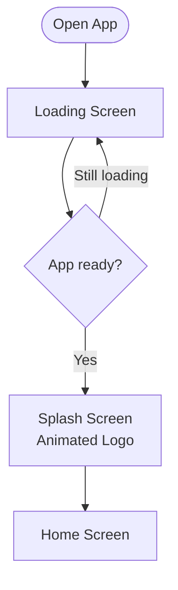
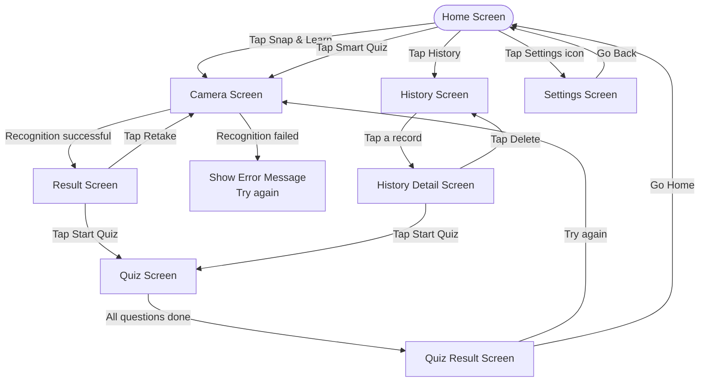
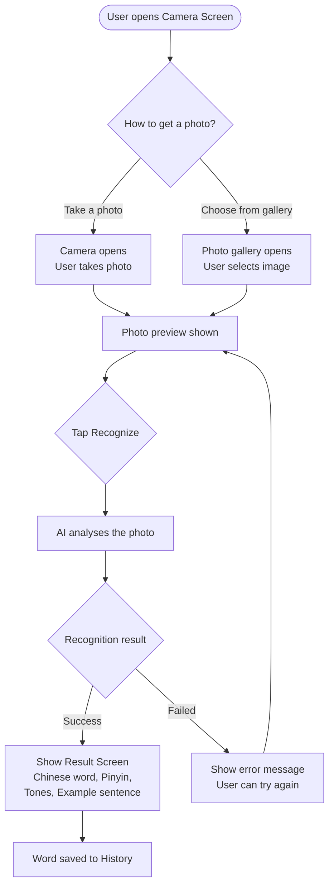
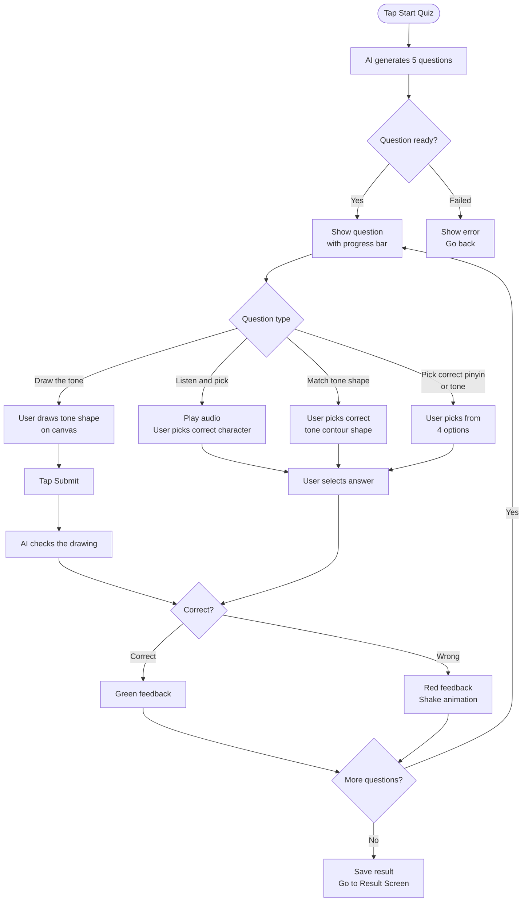
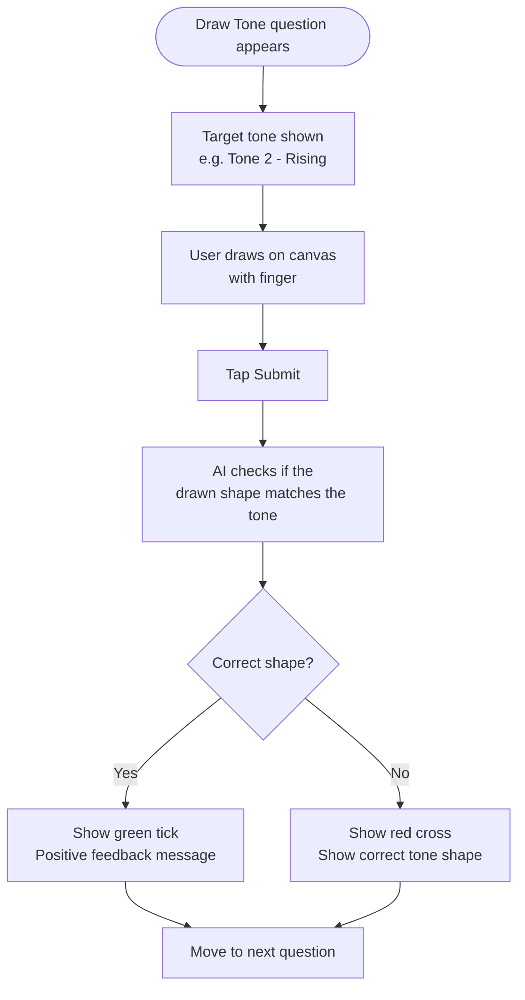
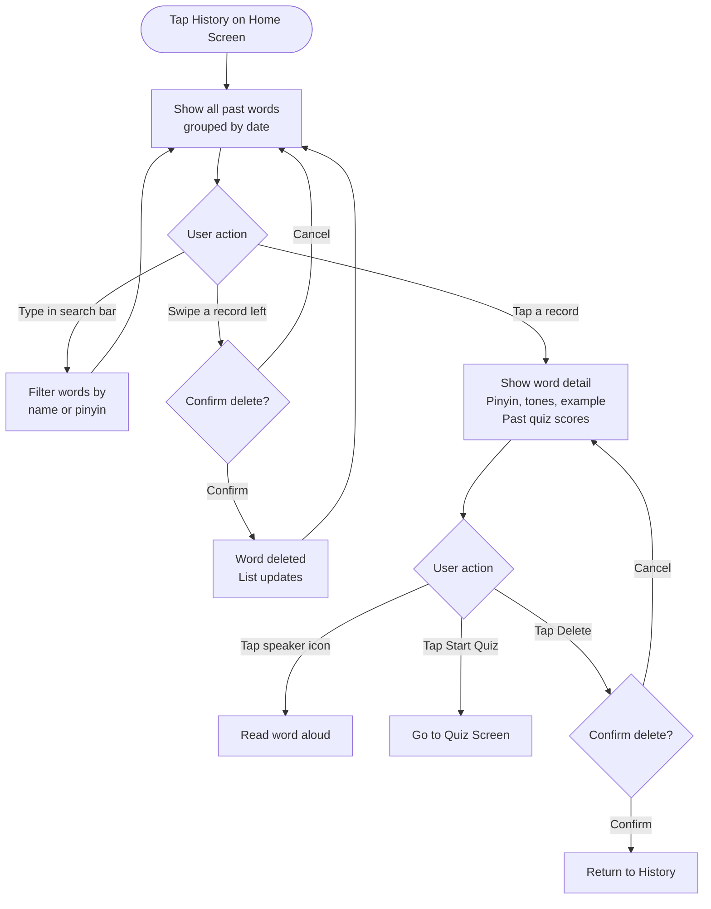
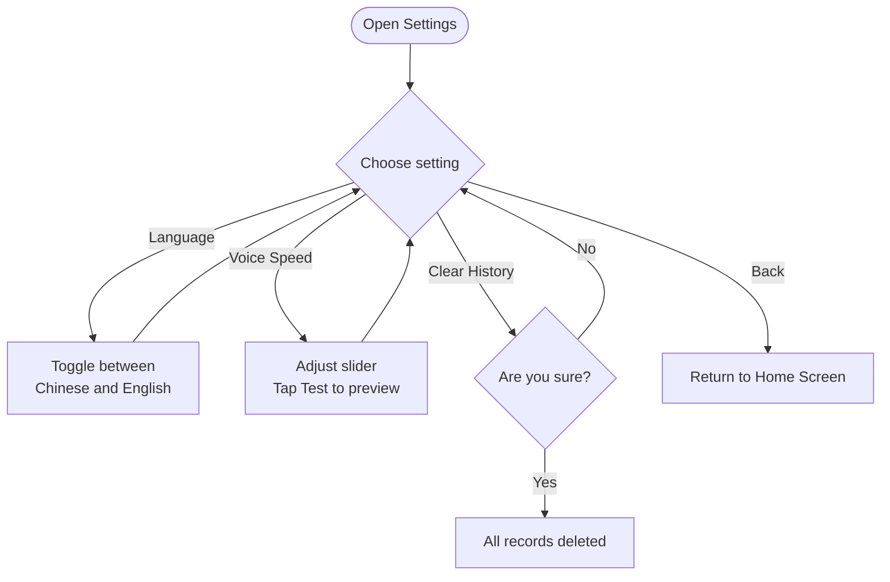
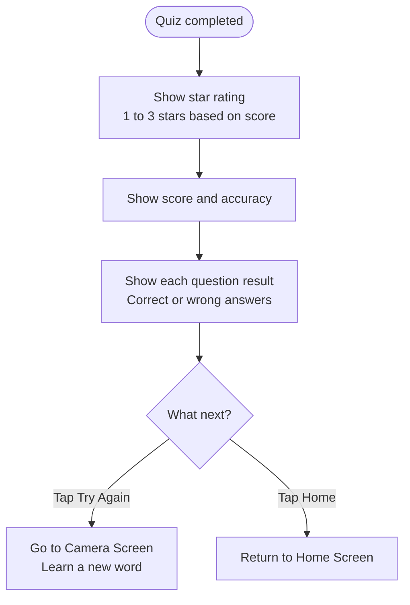

# PinPin Go 拼拼樂 — App Flowcharts

## 1. App Startup

---

## 2. App Navigation Overview

---

## 3. Photo Recognition Flow

---

## 4. Quiz Flow

---

## 5. Tone Drawing Flow

---

## 6. Learning History Flow

---

## 7. Settings Flow

---

## 8. Quiz Result Flow

