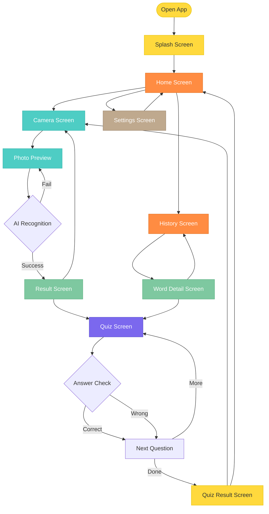

# PinPin Go 拼拼樂 — App Storyboard Flowchart

```mermaid
flowchart TD
    A([Open App]) --> B[Splash Screen]
    B --> C[Home Screen]

    C --> D[Camera Screen]
    C --> E[History Screen]
    C --> F[Settings Screen]
    F --> C

    D --> G[Photo Preview]
    G --> H{AI Recognition}
    H -->|Success| I[Result Screen]
    H -->|Fail| G

    I --> J[Quiz Screen]
    I --> D

    J --> K{Answer Check}
    K -->|Correct| L[Next Question]
    K -->|Wrong| L
    L -->|More| J
    L -->|Done| M[Quiz Result Screen]

    M --> D
    M --> C

    E --> N[Word Detail Screen]
    N --> J
    N --> E

    style A fill:#FFD93D,stroke:#E6C200,color:#333
    style B fill:#FFD93D,stroke:#E6C200,color:#333
    style C fill:#FF8C42,stroke:#E07020,color:#fff
    style D fill:#4ECDC4,stroke:#36B5AC,color:#fff
    style G fill:#4ECDC4,stroke:#36B5AC,color:#fff
    style I fill:#7EC8A0,stroke:#5BAF80,color:#fff
    style J fill:#7B68EE,stroke:#5A4FCC,color:#fff
    style M fill:#FFD93D,stroke:#E6C200,color:#333
    style E fill:#FF8C42,stroke:#E07020,color:#fff
    style N fill:#7EC8A0,stroke:#5BAF80,color:#fff
    style F fill:#BFA98E,stroke:#9E8870,color:#fff
```
